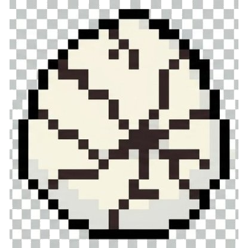

PenguEgg

A desktop battery companion that grows from an egg into a penguin.

PenguEgg transforms battery status into a small virtual pet, making everyday system information more playful and engaging.

  
  
  
  
  

Concept

Most devices display battery levels as numbers.

PenguEgg represents battery status through a pixel-art penguin that evolves as the battery level changes.

States

🥚 Egg

🐣 Hatching

🐧 Baby Penguin

🚶 Walking Penguin

Features
Real-time battery monitoring
Pixel-art animations
Multiple growth stages
Lightweight desktop experience
Vision

Turn boring system indicators into delightful companions.
